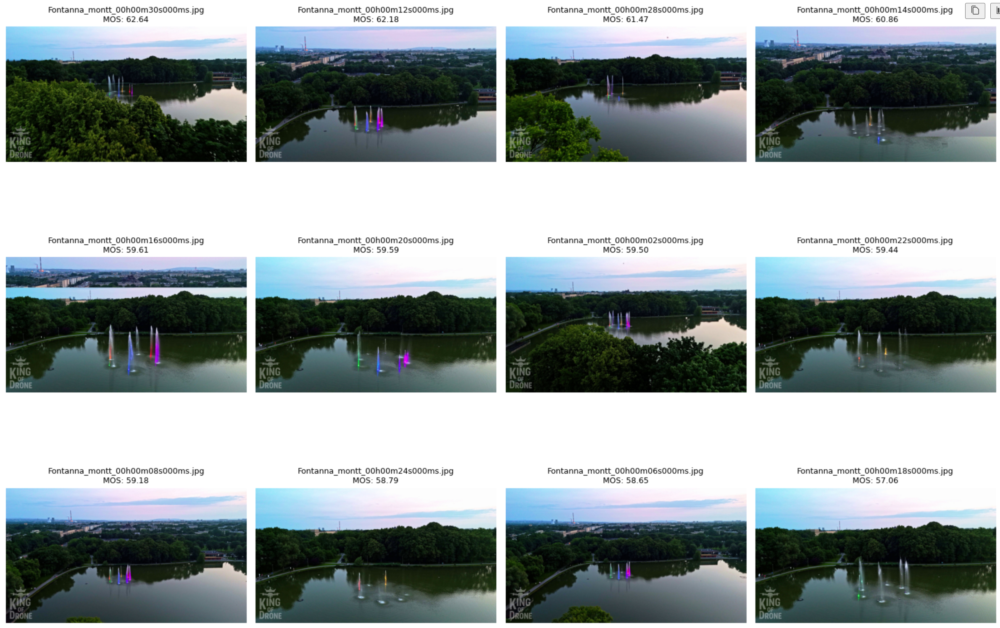
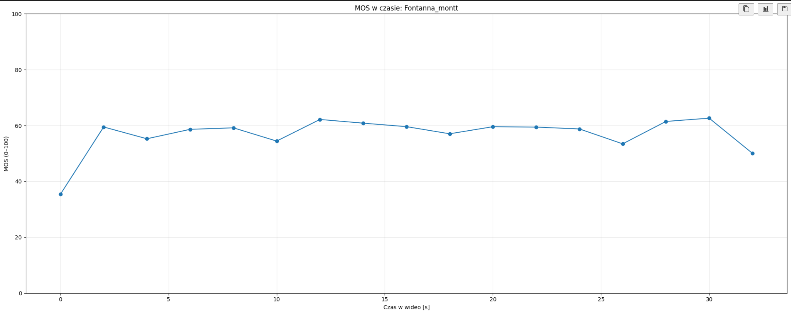

# 🎥 Drone Quality Assessment — AI Visual Quality Scoring for Drone Footage

Determine the best-looking moments from your drone footage using an AI-powered **Mean Opinion Score (MOS)** model.  
Automatically extract frames from video, evaluate their perceptual quality (0–100), and select the top cinematic shots for editing.

✅ Works fully offline  
✅ Designed for drone videography and post-production workflow  
✅ Generate quick quality reports for entire flights

---

## ✨ Key Features

| Feature | Description |
|--------|-------------|
| 🎬 Video frame extraction | Grab frames every *X* seconds from .MP4 |
| 🧠 MOS quality prediction | AI predicts perceived visual quality (0–100) |
| 📊 Timeline visualization | See quality change over the flight |
| 🏆 Best shots selection | Picks top frames for editing |
| 📝 Export results | CSV sorted by MOS |
| ✨ Offline & local | No video uploads to cloud |

---

## 🧠 AI Model

| Component | Details |
|--------|---------|
| Architecture | ResNet18 backbone (ImageNet pretrained) |
| Head | 1-neuron regression for MOS |
| Output range | 0–100 |
| Loss function | MAE |
| Framework | PyTorch |

### Training Dataset

📌 **KonIQ-10k** — 10,073 images with MOS quality labels  
https://database.mmsp-kn.de/koniq-10k-database.html

This dataset represents real human perception of image quality.

---

## 📂 Project Structure
```
drone-quality-assessment/
│
├── data/
│ ├── frames/ # extracted frames
│ └── videos/ # your .mp4 files
│
├── model/
│ └── cnn_model.py # ResNet18 + MOS head
│
├── notebooks/
│ ├── train_mos_model.ipynb # optional model training
│ └── drone_mos_inference.ipynb # ✅ use trained model on new footage
│
├── video_to_frames/
│ └── extract_frames.py # frame extraction tool
│
├── results/
│ └── <video_name>/ # report outputs
│
├── best_mos.pth # ✅ trained model weights
└── README.md
```
---

## 🚀 How to Use

### ✅ Option A — MOS scoring using pre-trained model (recommended)

1️⃣ Put your drone footage here:

2️⃣ Extract frames:
```bash
python video_to_frames/extract_frames.py \
    --video "data/videos/my_flight.mp4" \
    --step 5 \
    --out data/frames/my_flight

notebooks/drone_mos_inference.ipynb

notebooks/train_mos_model.ipynb
```

## Dependiencies

torch
torchvision
opencv-python
pillow
pandas
numpy
matplotlib
tqdm

## 🖼 Przykładowe wyniki działania

### Najlepsze klatki z nagrania ✨


### Jakość w czasie nagrania


